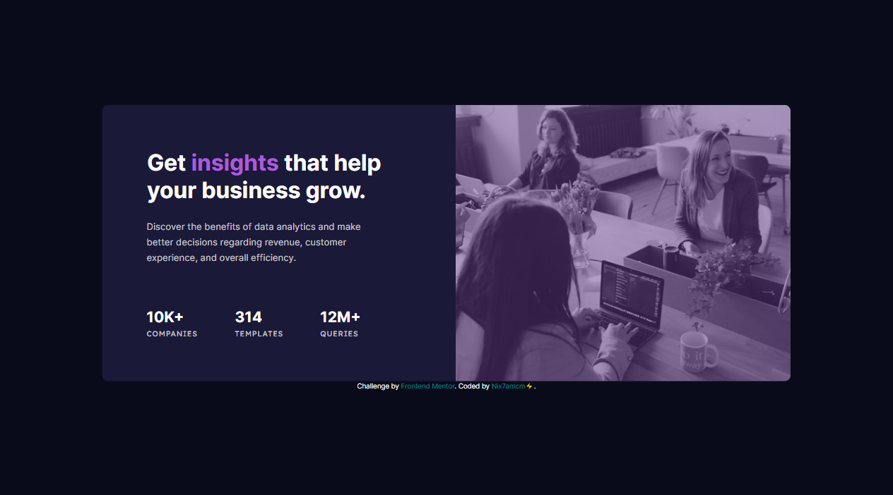

# Frontend Mentor - Stats preview card component solution

This is my solution to the [Stats preview card component challenge on Frontend Mentor](https://www.frontendmentor.io/challenges/stats-preview-card-component-8JqbgoU62).

## Table of contents

- [Overview](#overview)
  - [Challenge Requirements](#challenge-requirements)
- [Screenshots](#screenshots)
- [Links](#links)
- [My process](#my-process)
  - [Built with](#built-with)
  - [Useful resources](#useful-resources)
- [Author](#author)

---

## Overview

👩🏻‍💻 [Frontend Mentor](www.frontendmentor.io) challenges help you improve your coding skills by building realistic projects.

⚡ This challenge was to build a responsive stats preview card component.

🚀 I built this using HTML and CSS, with the help of [Figma](https://www.figma.com) for studying the design.

### Challenge Requirements

Users should be able to:

- View the optimal layout depending on their device's screen size

---

## Screenshots

---

## Links

- Solution URL: [frontendmentor.io/solutions/stats-preview-card-component-YDmYtWx03M](https://www.frontendmentor.io/solutions/stats-preview-card-component-YDmYtWx03M)
- Live Site URL: [nix7amcm.github.io/FEM-stats-preview-card-component/](https://nix7amcm.github.io/FEM-stats-preview-card-component/)

---

## My process

### Built with

- Semantic HTML5 markup
- CSS custom properties
- Flexbox
- CSS Grid
- Figma

### Useful resources
- [Tailwind.css](https://tailwindcss.com/) - This helped me add the [sr-only](https://tailwindcss.com/docs/screen-readers#screen-reader-only-elements) class style for the hidden header with the h1 title, so that it can still be accessed by screen readers.

---

## Author

- Website - [Nix7amcm](https://github.com/Nix7amcm)
- Frontend Mentor - [@Nix7amcm](https://www.frontendmentor.io/profile/Nix7amcm)
- LinkedIn - [amcm-8807](https://www.linkedin.com/in/amcm-8807/)

---
---